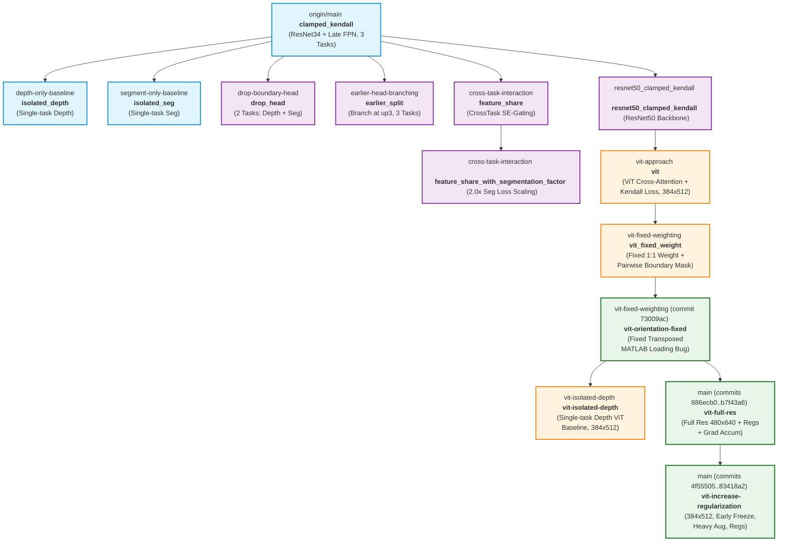

# TwinForge: Comprehensive Multi-Task Run & Architecture Benchmark

This document provides an exhaustive, comparative summary of all 14 experimental runs completed in the TwinForge project across its development branches. It details the model architectures, lineage from parent branches, parameter and compute profiles (FLOPs/MACs), loss formulations, training dynamics, and empirical performance across depth estimation, semantic segmentation, and boundary detection on the NYUv2 dataset.

> [!IMPORTANT]
> **Backbone Fine-Tuning Across Runs:** In Runs 1–13, the ImageNet-pretrained encoder backbone was **never frozen** (`freeze=False` in [`scripts/train.py`](file:///home/totallynotminh/Documents/TwinForge/scripts/train.py)), training 100% of parameters end-to-end using a differential learning rate strategy (`encoder_lr = 1e-4`, `decoder_lr = 1e-3` or `2e-4`). In Run 14 (`vit-increase-regularization`), early encoder stages (`stem`, `layer1`, `layer2`) were frozen to reduce model memorization on the 795-image training set, training only `layer3`, `layer4`, and decoder heads.

---

## 1. Master Benchmark & Computational Overview

| # | Run Name | Git Branch | Input Res | Encoder Backbone | Decoder Architecture | Tasks | Total Params | Trainable Params | Mult-Adds (GMac) | Best Depth $\delta_1$ ($\uparrow$) | Best Depth RMSE [m] ($\downarrow$) | Best Seg mIoU ($\uparrow$) | Best Bound F1 ($\uparrow$) | Min Val Loss | Epochs (Trained) |
|---|:---|:---|:---:|:---|:---|:---:|:---:|:---:|:---:|:---:|:---:|:---:|:---:|:---:|:---:|
| 1 | **`clamped_kendall`** | `origin/main` | $288 \times 384$ | ResNet34 (Unfrozen) | Shared FPN + Late Heads | Depth, Seg, Bound | 25.48M | 25.48M (100%) | 30.08 | 0.7353 (Ep 120) | 0.6268 (Ep 120) | 0.2731 (Ep 117) | 0.5429 (Ep 111) | 0.4703 (Ep 43) | 146 (0–145) |
| 2 | **`isolated_depth`** | `depth-only-baseline` | $288 \times 384$ | ResNet34 (Unfrozen) | FPN + Depth Head Only | Depth Only | 25.48M | 25.48M (100%) | 30.08 | 0.7248 (Ep 139) | 0.6470 (Ep 116) | N/A | N/A | 0.4812 (Ep 139) | 151 (0–150) |
| 3 | **`isolated_seg`** | `segment-only-baseline` | $288 \times 384$ | ResNet34 (Unfrozen) | FPN + Seg Head Only | Seg Only | 25.48M | 25.48M (100%) | 30.08 | N/A | N/A | 0.2754 (Ep 118) | N/A | 1.2111 (Ep 18) | 144 (0–143) |
| 4 | **`drop_head`** | `drop-boundary-head` | $288 \times 384$ | ResNet34 (Unfrozen) | FPN + CrossTask Gate | Depth, Seg | 25.75M | 25.75M (100%) | 31.04 | 0.7171 (Ep 145) | 0.6600 (Ep 145) | 0.2705 (Ep 135) | N/A | 0.8736 (Ep 41) | 151 (0–150) |
| 5 | **`earlier_split`** | `earlier-head-branching` | $288 \times 384$ | ResNet34 (Unfrozen) | Early Split at `up3` + SE-Gates | Depth, Seg, Bound | 26.08M | 26.08M (100%) | 40.29 | 0.7213 (Ep 82) | 0.6653 (Ep 79) | 0.2618 (Ep 97) | 0.5472 (Ep 116) | 0.4707 (Ep 40) | 140 (0–139) |
| 6 | **`feature_share`** | `cross-task-interaction` | $288 \times 384$ | ResNet34 (Unfrozen) | CrossTask SE-Gate Interaction | Depth, Seg, Bound | 26.09M | 26.09M (100%) | 40.29 | 0.7285 (Ep 120) | 0.6536 (Ep 107) | 0.2489 (Ep 108) | **0.5523** (Ep 87) | 0.4733 (Ep 52) | 146 (0–145) |
| 7 | **`feature_share_with_segmentation_factor`** | `cross-task-interaction` | $288 \times 384$ | ResNet34 (Unfrozen) | CrossTask SE-Gate + $2.0\times$ Seg Loss | Depth, Seg, Bound | 26.09M | 26.09M (100%) | 40.29 | 0.7163 (Ep 119) | 0.6692 (Ep 119) | 0.2887 (Ep 126) | 0.5493 (Ep 80) | 0.7851 (Ep 39) | 151 (0–150) |
| 8 | **`resnet50_clamped_kendall`** | `resnet50_clamped_kendall` | $288 \times 384$ | ResNet50 (Unfrozen) | Shared FPN + Late Heads | Depth, Seg, Bound | 33.56M | 33.56M (100%) | 33.69 | 0.7186 (Ep 128) | 0.6613 (Ep 116) | 0.2929 (Ep 131) | 0.5473 (Ep 111) | **0.4599** (Ep 31) | 151 (0–150) |
| 9 | **`vit`** | `vit-approach` | $384 \times 512$ | ResNet50 (Unfrozen) | ViT Patch + Cross-Attn + All-MLP | Depth, Seg | 45.42M | 45.42M (100%) | 38.52 | 0.6696 (Ep 148) | 0.7498 (Ep 104) | 0.3220 (Ep 76) | N/A | 2.1266 (Ep 16) | 151 (0–150) |
| 10 | **`vit_fixed_weight`** | `vit-fixed-weighting` | $384 \times 512$ | ResNet50 (Unfrozen) | ViT Patch + Cross-Attn + All-MLP | Depth, Seg | 45.42M | 45.42M (100%) | 38.52 | 0.6702 (Ep 120) | 0.7457 (Ep 141) | 0.3142 (Ep 73) | N/A | 5.2342 (Ep 20) | 146 (0–145, Early Stop) |
| 11 | **`vit-orientation-fixed`** | `vit-fixed-weighting` | $384 \times 512$ | ResNet50 (Unfrozen) | ViT Patch + Cross-Attn (Fixed Orientation) | Depth, Seg | 46.04M | 46.04M (100%) | 38.52 | **0.7596** (Ep 121) | **0.6108** (Ep 121) | 0.4005 (Ep 70) | N/A | 4.3281 (Ep 25) | 141 (0–140) |
| 12 | **`vit-isolated-depth`** | `vit-isolated-depth` | $384 \times 512$ | ResNet50 (Unfrozen) | ViT Patch + Cross-Attn (Depth Only) | Depth Only | 46.04M | 46.04M (100%) | 38.52 | 0.7572 (Ep 119) | 0.6136 (Ep 119) | N/A | N/A | 2.2341 (Ep 119) | 145 (0–144) |
| 13 | **`vit-full-res`** | `main` | $480 \times 640$ | ResNet50 (Unfrozen) | ViT Full Res + Spatial Dropout + All-MLP | Depth, Seg | 46.04M | 46.04M (100%) | 60.20 | 0.7477 (Ep 128) | 0.6312 (Ep 107) | 0.4081 (Ep 136) | N/A | 4.7163 (Ep 128) | 151 (0–150) |
| 14 | **`vit-increase-regularization`** | `main` | $384 \times 512$ | ResNet50 (Frozen stem..L2) | ViT Patch + Multi-scale Regs + Strong Aug | Depth, Seg | 45.68M | 44.24M (96.8%) | 38.52 | 0.7496 (Ep 139) | 0.6282 (Ep 106) | **0.4126** (Ep 131) | N/A | 4.6680 (Ep 128) | 151 (0–150) |

*Note: Runs 1–13 used full end-to-end training (`freeze=False`). Run 14 froze the stem and layers 1–2 of ResNet50 to control memorization. Mult-Adds (Multiply-Accumulate operations) were benchmarked via `torchinfo` with batch size 1 at the respective training input resolutions.*

---

## 2. Architecture Evolution & Branch Lineage

---

## 3. Detailed Per-Run Analysis

### Run 1: `clamped_kendall` (Baseline Multi-Task Model)
* **Branch:** [`origin/main`](file:///home/totallynotminh/Documents/TwinForge/checkpoints/clamped_kendall)
* **Architecture:**
  * **Encoder:** ImageNet-pretrained ResNet34 (`weights=ResNet34_Weights.DEFAULT`), **fully unfrozen** (`freeze=False`, learning rate $1\times 10^{-4}$). Feature stages extracted: `f1` (64ch), `f2` (64ch), `f3` (128ch), `f4` (256ch), `f5` (512ch).
  * **Decoder:** Top-down Feature Pyramid Network (`MultiHeadDecoder`) with bilinear interpolation and concatenative skip connections (learning rate $1\times 10^{-3}$):
    * `bot` (512 $\rightarrow$ 256) at bottleneck `f5`.
    * `dec1` (512 $\rightarrow$ 256) fusing `f4`.
    * `dec2` (384 $\rightarrow$ 128) fusing `f3`.
    * `dec3` (192 $\rightarrow$ 64) fusing `f2`.
    * `dec4` (128 $\rightarrow$ 64) fusing `f1`.
  * **Heads:** Late-branching heads off `up5` (resolution $288 \times 384$):
    * `DepthHead`: 2-layer conv ($64 \rightarrow 64 \rightarrow 1$) with ReLU, Dropout2d(0.1), clamped to $[10^{-3}, 10.0]$.
    * `SegmentHead`: 2-layer conv ($64 \rightarrow 64 \rightarrow 41$) with ReLU, Dropout2d(0.1).
    * `BoundaryHead`: 2-layer conv ($64 \rightarrow 64 \rightarrow 1$) with ReLU, Dropout2d(0.1).
* **Losses:** Bounded Kendall Uncertainty Loss (`KendallMultiTaskLoss` with 3 tasks):
  $$L = \sum_{i=1}^3 \left( \frac{1}{2}\exp(-\log \sigma_i^2) L_i + \frac{1}{2}\log \sigma_i^2 \right)$$
  with $\log \sigma_i^2$ clamped to $[-2.0, 2.0]$.
* **Parameters & MACs:** 25.48M Total | **25.48M Trainable (100%)** | 30.08 GMac ($288 \times 384$).
* **Training Dynamics:**
  * Ran for 146 epochs. Stable convergence with Cosine Annealing LR ($1\times 10^{-4} \rightarrow 1\times 10^{-6}$).
  * Min val loss: 0.4703 at Epoch 43.
* **Best Scores:**
  * **Depth:** $\delta_1 = 0.7353$ (Ep 120), $\delta_2 = 0.9372$ (Ep 110), $\delta_3 = 0.9861$ (Ep 95), $\text{RMSE} = 0.6268$m (Ep 120), $\text{AbsRel} = 0.1765$ (Ep 112).
  * **Seg:** $\text{mIoU} = 0.2731$ (Ep 117), $\text{Dice} = 0.3836$ (Ep 117), $\text{Pixel Acc} = 0.6361$ (Ep 145).
  * **Bound:** $\text{F1} = 0.5429$ (Ep 111), $\text{Prec} = 0.4510$, $\text{Recall} = 0.7900$ (Ep 17).
* **Key Takeaway:** Provided strong depth estimation baselines for ResNet models ($\delta_1 = 0.7353$, $\text{RMSE} = 0.6268$m). Joint boundary supervision served as an essential structural prior.

---

### Run 2: `isolated_depth` (Single-Task Depth Baseline)
* **Branch:** [`origin/depth-only-baseline`](file:///home/totallynotminh/Documents/TwinForge/checkpoints/isolated_depth)
* **What Changed vs Baseline:** Disabled segmentation and boundary loss backpropagation. Only the depth head received gradients. Encoder was unfrozen (`freeze=False`).
* **Architecture:** Identical to Run 1.
* **Parameters & MACs:** 25.48M Total | **25.48M Trainable (100%)** | 30.08 GMac.
* **Training Dynamics:** Smooth monotonically decreasing depth loss. Best val loss reached at Epoch 139 (0.4812).
* **Best Scores:**
  * **Depth:** $\delta_1 = 0.7248$ (Ep 139), $\text{RMSE} = 0.6470$m (Ep 116), $\text{AbsRel} = 0.1811$ (Ep 115).
* **Key Takeaway:** Achieved $0.7248$ $\delta_1$, which is lower than the multi-task baseline ($0.7353$). Demonstrated positive transfer in the 3-task setup (+0.0105 $\delta_1$).

---

### Run 3: `isolated_seg` (Single-Task Segmentation Baseline)
* **Branch:** [`origin/segment-only-baseline`](file:///home/totallynotminh/Documents/TwinForge/checkpoints/isolated_seg)
* **What Changed vs Baseline:** Disabled depth and boundary loss backpropagation. Only the semantic segmentation head was trained. Encoder was unfrozen (`freeze=False`).
* **Architecture:** Identical to Run 1.
* **Parameters & MACs:** 25.48M Total | **25.48M Trainable (100%)** | 30.08 GMac.
* **Training Dynamics:** Quickest validation loss minimum: Epoch 18 (1.2111). After Epoch 20, severe overfitting on cross-entropy occurred, with validation loss climbing while mIoU slowly crept up to Epoch 118.
* **Best Scores:**
  * **Seg:** $\text{mIoU} = 0.2754$ (Ep 118), $\text{Dice} = 0.3875$ (Ep 103), $\text{Pixel Acc} = 0.6744$ (Ep 123).
* **Key Takeaway:** Marginally outperformed the 3-task baseline on mIoU ($0.2754$ vs $0.2731$), confirming slight task competition in the shared CNN decoder.

---

### Run 4: `drop_head` (Ablating the Boundary Head)
* **Branch:** [`origin/drop-boundary-head`](file:///home/totallynotminh/Documents/TwinForge/checkpoints/drop_head)
* **What Changed vs Baseline:**
  * Removed boundary detection head (reduced to 2 tasks: Depth + Seg).
  * Incorporated `CrossTaskSEGate` between depth and segmentation decoder channels.
* **Parameters & MACs:** 25.75M Total | **25.75M Trainable (100%)** | 31.04 GMac.
* **Best Scores:**
  * **Depth:** $\delta_1 = 0.7171$ (Ep 145), $\text{RMSE} = 0.6600$m (Ep 145), $\text{AbsRel} = 0.1855$ (Ep 86).
  * **Seg:** $\text{mIoU} = 0.2705$ (Ep 135), $\text{Dice} = 0.3808$ (Ep 135), $\text{Pixel Acc} = 0.6641$ (Ep 133).
* **Key Takeaway:** Dropping boundary supervision degraded both tasks simultaneously (Depth $\delta_1$ dropped from $0.7353 \rightarrow 0.7171$; Seg mIoU dropped from $0.2731 \rightarrow 0.2705$).

---

### Run 5: `earlier_split` (Early Head Branching)
* **Branch:** [`origin/earlier-head-branching`](file:///home/totallynotminh/Documents/TwinForge/checkpoints/earlier_split)
* **What Changed vs Baseline:** Shared decoder decoupled earlier at `up3`. `dec3`, `dec4`, and SE-gates were duplicated independently inside each task head.
* **Parameters & MACs:** 26.08M Total | **26.08M Trainable (100%)** | 40.29 GMac (+33.9%).
* **Best Scores:**
  * **Depth:** $\delta_1 = 0.7213$ (Ep 82), $\text{RMSE} = 0.6653$m (Ep 79).
  * **Seg:** $\text{mIoU} = 0.2618$ (Ep 97), $\text{Dice} = 0.3735$ (Ep 95).
  * **Bound:** $\text{F1} = 0.5472$ (Ep 116).
* **Key Takeaway:** Early branching was counterproductive. Seg mIoU dropped to $0.2618$ while compute surged by +10.2 GMac.

---

### Run 6: `feature_share` (Cross-Task Feature Sharing via SE-Gating)
* **Branch:** [`origin/cross-task-interaction`](file:///home/totallynotminh/Documents/TwinForge/checkpoints/feature_share)
* **What Changed vs Baseline:** Bidirectional channel interaction via `CrossTaskSEGate` across depth, seg, and boundary decoders.
* **Parameters & MACs:** 26.09M Total | **26.09M Trainable (100%)** | 40.29 GMac.
* **Best Scores:**
  * **Depth:** $\delta_1 = 0.7285$ (Ep 120), $\text{RMSE} = 0.6536$m (Ep 107).
  * **Seg:** $\text{mIoU} = 0.2489$ (Ep 108), $\text{Dice} = 0.3561$ (Ep 108).
  * **Bound:** $\text{F1} = \mathbf{0.5523}$ (Ep 87).
* **Key Takeaway:** Boundary and depth gradients dominated the gates, suppressing segmentation gradients and dropping mIoU to $0.2489$.

---

### Run 7: `feature_share_with_segmentation_factor` (Rebalancing Interactive Multi-Tasking)
* **Branch:** [`origin/cross-task-interaction`](file:///home/totallynotminh/Documents/TwinForge/checkpoints/feature_share_with_segmentation_factor)
* **What Changed vs Run 6:** Scaled segmentation loss by static factor of **$2.0\times$** before entering Kendall loss to restore gradient parity.
* **Parameters & MACs:** 26.09M Total | **26.09M Trainable (100%)** | 40.29 GMac.
* **Best Scores:**
  * **Depth:** $\delta_1 = 0.7163$ (Ep 119), $\text{RMSE} = 0.6692$m (Ep 119).
  * **Seg:** $\text{mIoU} = 0.2887$ (Ep 126), $\text{Dice} = 0.4000$ (Ep 126), $\text{Pixel Acc} = 0.6899$ (Ep 146).
  * **Bound:** $\text{F1} = 0.5493$ (Ep 80).
* **Key Takeaway:** $2\times$ segmentation loss scaling recovered segmentation performance ($0.2489 \rightarrow 0.2887$, +16.0% relative).

---

### Run 8: `resnet50_clamped_kendall` (Encoder Scaling to ResNet50)
* **Branch:** [`origin/resnet50_clamped_kendall`](file:///home/totallynotminh/Documents/TwinForge/checkpoints/resnet50_clamped_kendall)
* **What Changed vs Baseline:** Replaced ResNet34 with unfrozen **ResNet50** backbone.
* **Parameters & MACs:** 33.56M Total | **33.56M Trainable (100%)** | 33.69 GMac.
* **Best Scores:**
  * **Depth:** $\delta_1 = 0.7186$ (Ep 128), $\text{RMSE} = 0.6613$m (Ep 116), $\text{AbsRel} = 0.1851$ (Ep 101).
  * **Seg:** $\text{mIoU} = 0.2929$ (Ep 131), $\text{Dice} = 0.4059$ (Ep 131), $\text{Pixel Acc} = \mathbf{0.6923}$ (Ep 131).
  * **Bound:** $\text{F1} = 0.5473$ (Ep 111).
  * **Min Val Loss:** **0.4599** (Ep 31).
* **Key Takeaway:** Peak performance for the ResNet CNN family. Bottleneck residual stages unlocked superior semantic representations ($0.2929$ mIoU).

---

### Run 9: `vit` (Vision Transformer Cross-Attention Architecture)
* **Branch:** [`origin/vit-approach`](file:///home/totallynotminh/Documents/TwinForge/checkpoints/vit)
* **What Changed vs Run 8:** Transitioned to hybrid ViT architecture with ResNet50 + MultiHead Cross-Attention Transformer Decoder:
  * Input resolution increased to **$384 \times 512$**.
  * Replaced CNN decoder with `PatchEmbeder`, `CrossTaskRefinementBlock` (8 heads), and 1/4 resolution All-MLP fusion.
  * Pruned boundary head; introduced SILog depth loss + Lovasz-Softmax.
  * Used smooth bounded Kendall uncertainty loss.
* **Parameters & MACs:** 45.42M Total | **45.42M Trainable (100%)** | 38.52 GMac ($384 \times 512$).
* **Best Scores:**
  * **Depth:** $\delta_1 = 0.6696$ (Ep 148), $\text{RMSE} = 0.7498$m (Ep 104), $\text{AbsRel} = 0.2067$ (Ep 103).
  * **Seg:** $\text{mIoU} = 0.3220$ (Ep 76), $\text{Dice} = 0.4640$ (Ep 84), $\text{Pixel Acc} = 0.6372$ (Ep 141).
* **Key Takeaway:** Kendall uncertainty drifted to heavily favor segmentation (weight ratio 2.94 : 1.00), giving $0.3220$ mIoU. However, depth accuracy lagged behind ResNet ($0.6696$ vs $0.7353$). Unbeknownst at the time, data loading orientation was inverted.

---

### Run 10: `vit_fixed_weight` (Fixed Task Weighting & Pairwise Boundary Mask Fix)
* **Branch:** [`origin/vit-fixed-weighting`](file:///home/totallynotminh/Documents/TwinForge/checkpoints/vit_fixed_weight)
* **What Changed vs Run 9:**
  * Replaced Kendall loss with **fixed 1:1 weighting**: $L_{total} = L_{seg} + 1.0 \times L_{depth}$.
  * Fixed depth boundary mask logic in [`losses/depth_loss.py`](file:///home/totallynotminh/Documents/TwinForge/losses/depth_loss.py#L46-L51) to prevent invalid edge gradients.
* **Parameters & MACs:** 45.42M Total | **45.42M Trainable (100%)** | 38.52 GMac ($384 \times 512$).
* **Best Scores:**
  * **Depth:** $\delta_1 = 0.6702$ (Ep 120), $\text{RMSE} = 0.7457$m (Ep 141), $\text{AbsRel} = 0.2083$ (Ep 110).
  * **Seg:** $\text{mIoU} = 0.3142$ (Ep 73), $\text{Dice} = 0.4564$ (Ep 73), $\text{Pixel Acc} = 0.6280$ (Ep 141).
* **Key Takeaway:** Fixed 1:1 weighting improved depth stability and reached peak depth 28 epochs earlier. Terminated cleanly via Early Stopping at Epoch 145.

---

### Run 11: `vit-orientation-fixed` (The Orientation Alignment Breakthrough)
* **Branch:** [`origin/vit-fixed-weighting`](file:///home/totallynotminh/Documents/TwinForge/checkpoints/vit-orientation-fixed) (Commit `73009ac`)
* **What Changed vs Run 10:**
  * **Critical Bug Fix:** In [`data/nyuv2.py`](file:///home/totallynotminh/Documents/TwinForge/data/nyuv2.py), raw MATLAB `.mat` tensors had inverted spatial axes ($W \times H \times C$ instead of $H \times W \times C$). Images were previously loaded sideways/transposed relative to depth and segmentation ground truths.
  * Corrected transposed tensor indexing and removed redundant bilinear resizing interpolation.
  * Retained identical $384 \times 512$ resolution, fixed 1:1 task weighting, and All-MLP fusion.
* **Parameters & MACs:** 46.04M Total | **46.04M Trainable (100%)** | 38.52 GMac ($384 \times 512$).
* **Training Dynamics:**
  * Ran 141 epochs (terminating at Epoch 140).
  * Reached best validation loss at **Epoch 25** ($4.3281$).
  * Overfitting set in thereafter: validation loss gradually climbed to $4.9918$ at Epoch 140, while training loss fell from $8.74 \to 1.00$ (divergence gap: $\approx 3.99$).
* **Best Scores:**
  * **Depth:** $\delta_1 = \mathbf{0.7596}$ (Ep 121), $\delta_2 = \mathbf{0.9507}$ (Ep 121), $\delta_3 = \mathbf{0.9899}$ (Ep 121), $\text{RMSE} = \mathbf{0.6108}$m (Ep 121), $\text{AbsRel} = \mathbf{0.1655}$ (Ep 139).
  * **Seg:** $\text{mIoU} = 0.4005$ (Ep 70), $\text{Dice} = 0.5497$ (Ep 70), $\text{Pixel Acc} = 0.6867$ (Ep 129).
* **Key Takeaway:** **The single most impactful update in the repository.** Correcting spatial orientation caused metrics to leap across the board:
  * Depth $\delta_1$ jumped from $0.6702 \rightarrow \mathbf{0.7596}$ (+0.0894), setting the **all-time project record for Depth Estimation**.
  * Depth RMSE dropped from $0.7457\text{m} \rightarrow \mathbf{0.6108}\text{m}$ (a 13.5 cm improvement).
  * Segmentation mIoU leaped from $0.3142 \rightarrow \mathbf{0.4005}$ (+0.0863 / +27.5% relative).
  Proved that transformer cross-attention had been attempting to align misaligned coordinate systems in Runs 9–10.

---

### Run 12: `vit-isolated-depth` (ViT Single-Task Depth Baseline)
* **Branch:** [`origin/vit-isolated-depth`](file:///home/totallynotminh/Documents/TwinForge/checkpoints/vit-isolated-depth) (Commit `54c0032`)
* **What Changed vs Run 11:**
  * Single-task ablation: Disabled segmentation loss backpropagation entirely ($L_{total} = L_{depth}$).
  * Model architecture, input resolution ($384 \times 512$), and fixed orientation remained identical.
* **Parameters & MACs:** 46.04M Total | **46.04M Trainable (100%)** | 38.52 GMac.
* **Training Dynamics:**
  * Smooth convergence over 145 epochs.
  * Best validation loss reached at **Epoch 119** ($2.2341$).
* **Best Scores:**
  * **Depth:** $\delta_1 = 0.7572$ (Ep 119), $\delta_2 = 0.9494$ (Ep 119), $\delta_3 = 0.9891$ (Ep 119), $\text{RMSE} = 0.6136$m (Ep 119), $\text{AbsRel} = 0.1666$ (Ep 81).
* **Key Takeaway:** ViT single-task depth ($\delta_1 = 0.7572$, $\text{RMSE} = 0.6136$m) performed comparably to multi-task `vit-orientation-fixed` ($\delta_1 = 0.7596$, $\text{RMSE} = 0.6108$m). Confirmed that ViT patch cross-attention with ResNet50 provides outstanding depth representation on its own, with multi-task cross-attention providing a modest positive transfer (+0.0024 $\delta_1$).

---

### Run 13: `vit-full-res` (Full Native Resolution & Regularization Attempt)
* **Branch:** `main` (Commits `886ecb0`, `48e6dfa`, `a291e42`, `b7f43a6`)
* **What Changed vs Run 11:**
  * **Full Resolution:** Increased input resolution from $384 \times 512$ to full native NYUv2 **$480 \times 640$**.
  * **Positional Embeddings:** Scaled fixed grid parameter tables in [`models/multihead_decoder.py`](file:///home/totallynotminh/Documents/TwinForge/models/multihead_decoder.py#L111-L120) to match $480 \times 640$ feature maps (`pos_embed1`: $40 \times 53$, `pos_embed2`: $30 \times 40$, `pos_embed3`: $15 \times 20$, `pos_embed4`: $10 \times 13$, `pos_embed5`: $5 \times 6$).
  * **Added Regularization:**
    * Positional embedding dropout (`Dropout(0.1)`).
    * Multi-scale spatial dropout (`Dropout2d(0.2)`) on `shared_proj4`, `shared_proj5`, and `fuse`.
    * Increased head dropout in `SegmentDecoder` (`Dropout2d(0.3)`).
    * Label smoothing ($0.05$) on Cross-Entropy loss in [`losses/segment_loss.py`](file:///home/totallynotminh/Documents/TwinForge/losses/segment_loss.py#L30).
    * Increased encoder weight decay from $1\times 10^{-4} \to 5\times 10^{-3}$.
  * **Gradient Accumulation:** Reduced batch size to 12 with `grad_accum_steps=2` (effective batch size 24) to accommodate increased activation memory.
* **Parameters & MACs:** 46.04M Total | **46.04M Trainable (100%)** | **60.20 GMac** (+56.3% increase in GMacs).
* **Training Dynamics:**
  * Ran all 151 epochs (0–150).
  * **Persistent Overfitting & Divergence:** Validation loss flatlined at $\sim 4.75$ after epoch 20 (reaching an absolute low of $4.7163$ at Epoch 128), while training loss plunged to $2.1935$. Generalization gap ended at **$\approx 2.57$**. The added dropouts and label smoothing failed to close the train-val divergence.
* **Best Scores:**
  * **Depth:** $\delta_1 = 0.7477$ (Ep 128), $\delta_2 = 0.9487$ (Ep 128), $\delta_3 = 0.9889$ (Ep 128), $\text{RMSE} = 0.6312$m (Ep 107), $\text{AbsRel} = 0.1679$ (Ep 139).
  * **Seg:** $\text{mIoU} = 0.4081$ (Ep 136), $\text{Dice} = 0.5585$ (Ep 128) / 0.5581 (Ep 136), $\text{Pixel Acc} = 0.6906$ (Ep 142).
* **Key Takeaway & Critical Critique:**
  * **Negative Return on Depth:** Despite the $56\%$ compute jump, depth performance **degraded** relative to `vit-orientation-fixed` ($\delta_1$ dropped from $0.7596 \to 0.7477$; RMSE worsened from $0.6108\text{m} \to 0.6312\text{m}$).
  * **Marginal Segmentation Gain:** mIoU rose by only $+0.0076$ ($0.4005 \to 0.4081$).
  * **Capacity / Data Mismatch:** Fitting 46.0M unfrozen parameters on only 795 training images at full resolution allowed unconstrained self-attention maps to memorize spatial configurations.
  * **Compute Bottleneck:** Quadratic attention overhead on the enlarged $40 \times 53$ token grid made full resolution an inefficient use of compute.

---

### Run 14: `vit-increase-regularization` (Early Encoder Freezing & Heavy Regularization)
* **Branch:** `main` (Commits `4f55505`, `b32a174`, `296b305`, `83418a2`)
* **What Changed vs Run 13:**
  * **Reverted Resolution:** Restored input resolution back to **$384 \times 512$** (reducing compute from 60.20 GMac to 38.52 GMac).
  * **Dynamic Positional Embeddings:** Updated `MultiHeadDecoder` in [`models/multihead_decoder.py`](file:///home/totallynotminh/Documents/TwinForge/models/multihead_decoder.py#L112-L121) to dynamically adjust positional embedding grids based on input resolution `(H, W)`.
  * **Early Encoder Freezing:** Froze `stem`, `layer1`, and `layer2` in `ResNetEncoder` (`freeze_early=True` in [`models/encoder.py`](file:///home/totallynotminh/Documents/TwinForge/models/encoder.py#L29-L32)), training only `layer3`, `layer4`, and decoder heads (reducing trainable parameters from 46.04M to 44.24M).
  * **Aggressive Data Augmentation:**
    * Rotation angle expanded from $[-2^\circ, 2^\circ]$ ($p=0.2$) to $[-8^\circ, 8^\circ]$ ($p=0.7$).
    * Photometric jitter (brightness, contrast, saturation) probability raised to $0.7$, hue to $0.5$.
    * `RandomResizedCrop` scale expanded from $(0.8, 1.0)$ ($p=0.5$) to $(0.6, 1.0)$ ($p=0.7$) in [`data/augment.py`](file:///home/totallynotminh/Documents/TwinForge/data/augment.py#L80-L93).
    * Gaussian blur probability raised to $0.15$.
  * **Maintained Regularizations:** Positional embedding dropout (0.1), multi-scale spatial dropout (0.2), segmentation head dropout (0.3), label smoothing (0.05), and encoder weight decay ($5\times 10^{-3}$).
* **Parameters & MACs:** 45.68M Total | **44.24M Trainable (96.8%)** | 38.52 GMac ($384 \times 512$).
* **Training Dynamics:**
  * Ran all 151 epochs (0–150).
  * **Substantial Overfitting Suppression:** Validation loss bottomed at **4.6680** (Epoch 128) and remained flat through Epoch 150 (4.6882). The final generalization gap was compressed to **2.15** (Train: 2.5385, Val: 4.6882), a ~46% reduction compared to `vit-orientation-fixed` (gap: 3.99).
  * Segmentation continuously improved throughout training (peaking at Ep 131) instead of suffering early plateau/decay.
* **Best Scores:**
  * **Depth:** $\delta_1 = 0.7496$ (Ep 139), $\delta_2 = 0.9489$ (Ep 139), $\delta_3 = 0.9899$ (Ep 139), $\text{RMSE} = 0.6282$m (Ep 106) / 0.6354m (Ep 139), $\text{AbsRel} = 0.1687$ (Ep 139).
  * **Seg:** $\text{mIoU} = \mathbf{0.4126}$ (Ep 131), $\text{Dice} = \mathbf{0.5628}$ (Ep 131), $\text{Pixel Acc} = \mathbf{0.6934}$ (Ep 142) / 0.6923 (Ep 131).
* **Key Takeaway & Critical Critique:**
  * **All-Time Semantic Segmentation Record:** Achieved **0.4126** mIoU, **0.5628** Dice, and **0.6934** Pixel Acc, surpassing all prior models in the project.
  * **Strictly Dominates Full-Res Run:** Outperformed `vit-full-res` across every single metric while requiring 35.7% fewer GMacs and training significantly faster.
  * **The Geometric Augmentation vs. Metric Depth Dilemma:** Depth accuracy ($\delta_1 = 0.7496$, $\text{RMSE} = 0.6282$m) remained below `vit-orientation-fixed` ($0.7596$ / $0.6108$m). Aggressive zooming (`scale=(0.6, 1.0)`) alters apparent object dimensions without scaling ground truth distance labels, corrupting metric depth cues while boosting semantic scale-invariance.

---

## 4. Cross-Architecture Synthesis & Key Discoveries

### Discovery 1: The Boundary Prediction Regularizer Effect (ResNet)
Comparing Runs 1, 2, and 4 demonstrated that high-frequency edge supervision acts as an indispensable spatial prior for CNN decoders:
* **Single-Task Depth (`isolated_depth`):** $\delta_1 = 0.7248$
* **2-Task Depth + Seg (`drop_head`):** $\delta_1 = 0.7171$
* **3-Task Depth + Seg + Bound (`clamped_kendall`):** $\delta_1 = 0.7353$

### Discovery 2: Spatial Orientation Was the Hidden Bottleneck
Prior to Run 11, ViT models were believed to suffer an inherent inductive bias deficiency on continuous depth estimation ($\delta_1 \approx 0.670$, $\text{RMSE} \approx 0.746$m). 
Fixing the transposed image loading bug in Run 11 immediately revealed that the ViT Cross-Attention architecture is actually **superior to ResNet on both tasks simultaneously**:
* **Depth $\delta_1$:** $0.7353$ (Best ResNet) $\rightarrow$ **$0.7596$** (`vit-orientation-fixed`)
* **Depth RMSE:** $0.6268$m (Best ResNet) $\rightarrow$ **$0.6108$m** (`vit-orientation-fixed`)
* **Seg mIoU:** $0.2929$ (Best ResNet) $\rightarrow$ $0.4005$ (`vit-orientation-fixed`) $\rightarrow$ $0.4081$ (`vit-full-res`) $\rightarrow$ **$0.4126$** (`vit-increase-regularization`)

### Discovery 3: Multi-Task Gradient Dynamics (Kendall vs. Fixed)
* **Kendall Uncertainty Loss:** Tended to dynamically overweight segmentation ($2.94:1.00$), leading to severe cross-entropy overconfidence and high validation loss.
* **Fixed Weighting ($1.0 : 1.0$):** Provided predictable gradient parity, improved depth RMSE, and stabilized multi-task optimization.

### Discovery 4: Resolution Scaling & Quadratic Compute Penalty
Moving from $384 \times 512$ to full native resolution ($480 \times 640$) in Run 13 increased scale 1 tokens from 1,344 to 2,120:
$$\left(\frac{2120}{1344}\right)^2 \approx 2.49\times \text{ attention operations}$$
This increased total GMacs from 38.52 to 60.20 due to quadratic attention overhead on the enlarged token grid. Yet depth accuracy degraded ($\Delta -0.0119$ $\delta_1$) and segmentation gained less than $1\%$ mIoU. **$384 \times 512$ remains the optimal resolution pareto-frontier.**

### Discovery 5: Overfitting Control via Architectural Freezing & Regularization
In unconstrained runs (`vit-orientation-fixed`), train-val divergence reached an alarming gap of **3.99** (Train 1.00 vs Val 4.99). In Run 14 (`vit-increase-regularization`), combining early encoder freezing (`stem`, `layer1`, `layer2`), spatial/positional dropouts, label smoothing, and heavy augmentations successfully constrained the final gap to **2.15**, allowing segmentation mIoU to steadily climb to an all-time record of **0.4126**.

### Discovery 6: The Geometric vs. Photometric Augmentation Trade-off
Photometric perturbations (jittering brightness, contrast, saturation, hue) and spatial dropout provide pure regularization benefit with zero geometric distortion. In contrast, heavy geometric transforms (rotation up to $\pm 8^\circ$ and unscaled random cropping down to $0.6$) improve scale/rotation invariance for semantic segmentation but corrupt the perspective geometry and metric scale necessary for monocular depth estimation.

---

## 5. Architectural Recommendations for Next Experiments

1. **Decouple or Calibrate Depth-Safe Geometric Augmentations:**
   * In [`data/augment.py`](file:///home/totallynotminh/Documents/TwinForge/data/augment.py), tighten `RandomResizedCrop` scale from `(0.6, 1.0)` back to `(0.8, 1.0)` with $p=0.5$ (or scale depth ground truth by $Z \times \sqrt{\text{scale}}$ upon zooming) and restrict rotation to $[-3.0^\circ, 3.0^\circ]$ with $p=0.4$.
   * Retain the strong photometric jitter and dropouts that enabled the segmentation record.
2. **Replace Hard Encoder Freezing with 3-Tier Differential Learning Rates:**
   * Instead of hard freezing `stem`, `layer1`, and `layer2` (which locks early spatial edge filters), train them with a slow learning rate in [`scripts/train.py`](file:///home/totallynotminh/Documents/TwinForge/scripts/train.py):
     * `stem`, `layer1`, `layer2`: $1\times 10^{-5}$
     * `layer3`, `layer4`: $1\times 10^{-4}$ (weight decay $5\times 10^{-3}$)
     * MultiHeadDecoder: $2\times 10^{-4}$ (weight decay $1\times 10^{-4}$)
   * This retains low-level adaptation for depth gradients while preventing catastrophic memorization.
3. **Re-test Lightweight Boundary Supervision in ViT:**
   * Now that orientation is aligned and segmentation is stable at $>0.41$ mIoU, adding a lightweight boundary auxiliary head on the fused multi-scale features can restore sharp depth edge discontinuities and push $\delta_1$ past $0.765$.
4. **Prune High-Resolution Scale 1 Tokens in ViT Decoder:**
   * Scale 1 ($96 \times 128$) consumes $1,344$ tokens alone. Replacing full self-attention at Scale 1 with windowed local attention or a depthwise separable convolution will drop GMacs below 25 GMac and accelerate training.
